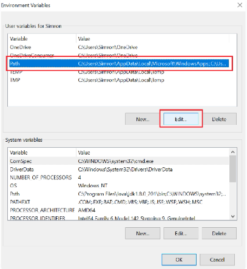

# 📦 Prerequisites

### GNU (GNU Compiler Collection):

The **GNU Compiler Collection** is an optimizing compiler produced by the **GNU Project** supporting various programming languages, inclduing **C language**



In order to install GCC on Windows, you need a toolkit such as MinGW (Minimalist GNU for Windows) to install it:

1. Download and install MinGW:&#x20;


MinGW official Download link


.png>).png>).png>)

2. Install needed packages:

Mark this following packages for installation:

* **`mingw32-base`**
* **`mingw32-gcc-g++`**

<figure><figcaption><p>Click with right button on package to view options and select "Mark for installation"</p></figcaption></figure>

then click on "Installation -> Apply Changes":

.png>)

Now confirm installation and wait until it finishs and click "Close"

.png>).png>).png>)

3. Add GCC to the PATH:

Currently, the command prompt cannot detect the **GCC** because the environment path variable has not been set. \
Follow the steps below to set the environment path variable for MinGW on the Windows system.


The environment path variable helps to detect the compiler in your whole system. It makes the alias name for the compiler, which denotes the path.&#x20;


1. Navigate to MinGW installation folder "default: C:\\\MinGW\\" and copy "bin" folder's adress (Default: "C:\\\MinGW\bin").
2. Click on Windows Search bar and type "Environment Variables" or "PATH"\
   .png>)
3. Click on "PATH" then "Edit" button\
   
4. Now click on "New" and paste the "/bin" folder address then click "OK".png>).png>)


And finally, you've GCC installed Successfully!, now you can compile C programs using gcc command:

```
gcc <filename>.c -o <filename>.exe //command
/*
Example: Compiling a C program I named myProject
gcc myProject.c -o myProject.exe
*/
```



In order to install GCC on Linux, you just need to run this command:

| Distro                                                       |                                                 |
| ------------------------------------------------------------ | ----------------------------------------------- |
| <p><strong>Debian</strong> or<br><strong>Ubuntu</strong></p> | **`sudo apt install build-essential`**          |
| **Arch Linux**                                               | **`sudo pacman -S base-devel`**                 |
| **Fedora** or **Red Hat**                                    | **`sudo dnf install gcc`**                      |
| **CentOS** or **RHEL**                                       | **`sudo yum groupinstall "Development Tools"`** |



To install **GCC (GNU Compiler Collection)** on **macOS**, you can use the package manager **Homebrew**. Here's how to do it:

1.  Install **Homebrew** if you haven't already. Open **Terminal** and run the following command:

    ```
    /bin/bash -c "$(curl -fsSL https://raw.githubusercontent.com/Homebrew/install/HEAD/install.sh)"
    ```
2.  Once **Homebrew** is installed, update it by running:

    ```
    brew update
    ```
3.  Install **GCC** by running the following command:

    ```
    brew install gcc
    ```
4.  After the installation completes, you can verify that **GCC** is installed by checking its version:

    ```
    gcc --version
    ```

That's it! **GCC** should now be installed on your **macOS** system using **Homebrew**.


