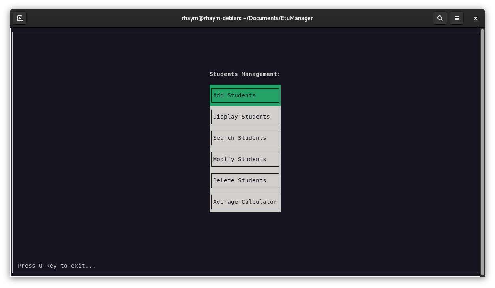

# ✨ Our Features

## A User-Friendly Text User Interface

Get amazing things done with awesome feature one. But remember that awesome feature two and three exist too. In fact, Awesome Product is full of awesome features.

<figure><figcaption>
Etumanager's Welcome Screen
</figcaption></figure>

<figure><figcaption>
EtuManager's options menu
</figcaption></figure>

## Add your student's data with EtuManager

**EtuManager** allows you to add a student to the list of registered students.\
User must enter the personal information of the student (name, first name, age, address, etc.), which will be stored in a text file named after the student in a folder called "/database".

<figure><figcaption>
User prompting a student data in EtuManager successfully
</figcaption></figure>

<figure><figcaption>
Student's data being stored in file with his name in the database folder
</figcaption></figure>

## Display all your stored student

Wanna overview your students that you entered, **EtuManager** has covered you!\
**EtuManager** gives you an option to display the list of registered students with their information personal. Data is read from the text files corresponding to each student.


**Pro tip:** You can use Left Arrow and Right Arrow buttons to switch between students.\
Left button is used to view the previous student and right arrow button is used to view the next student.


<figure><figcaption>
Displaying Students stored in database
</figcaption></figure>

## Search a Student!

**EtuManager**'s "Search Student" feature efficiently locates students in the database by only entering his name, providing instant access to their information upon successful identification. \
It streamlines the process, enhancing productivity by eliminating the need for manual searching.

<figure><figcaption>
Prompting a student first name or last name
</figcaption></figure>

<figure><figcaption>
EtuManager has found Student "Abderrahmane" data then displayed it
</figcaption></figure>

## Modify your student with EtuManager!

The **"Modify Student"** functionality in **EtuManager** enables users to efficiently update a student's file by specifying their name. This feature enhances productivity by allowing seamless modifications to the student's information, ensuring accurate and up-to-date records.

<figure><figcaption>
Updating student's info
</figcaption></figure>

<figure><figcaption>
EtuManager asks if I'd likes to update his modules info too (happens when you already added modules info to your student)
</figcaption></figure>

## Delete your student from Database

The **"Delete Student"** option in **EtuManager** allows users to efficiently delete a student's file by specifying their name. This feature enhances productivity by allowing users to delete unwanted or out dates students from database automatically.

<figure><figcaption>
Prompting student's full name to delete from database
</figcaption></figure>

<figure><figcaption>
EtuManager warns you before you preform deleting action
</figcaption></figure>

## Calculate your Students average!

With "Average Calculator" option, you can inspect your students academic road by storing their Modules data and calculating their averages!

<figure><figcaption>
You can add up to 100 modules infos to your students!
</figcaption></figure>

<figure><figcaption>
Entering a module info
</figcaption></figure>
