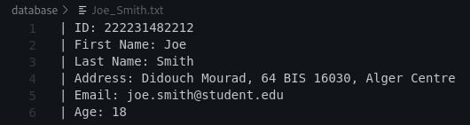

# ✨ Our Features


**GitBook tip:** A succinct video overview is a great way to introduce folks to your product. Embed a Loom, Vimeo or YouTube video and you're good to go! We love this video from the fine folks at Loom as a perfect example of a succinct feature overview.


## A User-Friendly Text User Interface

Get amazing things done with awesome feature one. But remember that awesome feature two and three exist too. In fact, Awesome Product is full of awesome features.

<figure><figcaption>
Etumanager's Welcome Screen
</figcaption></figure>

<figure><figcaption>
EtuManager's options menu
</figcaption></figure>

## Add your student's data with EtuManager&#x20;

**EtuManager** allows you to add a student to the list of registered students.\
User must enter the personal information of the student (name, first name, age, address, etc.), which will be stored in a text file named after the student in a folder called "/database".

<figure><figcaption>
User prompting a student data in EtuManager successfully
</figcaption></figure>

<figure><figcaption>
Student's data being stored in file with his name in the database folder
</figcaption></figure>

## Displaying Students

Wanna overview your students that you entered, **EtuManager** has covered you!\
**EtuManager** gives you an option to display the list of registered students with their information personal. Data is read from the text files corresponding to each student.

